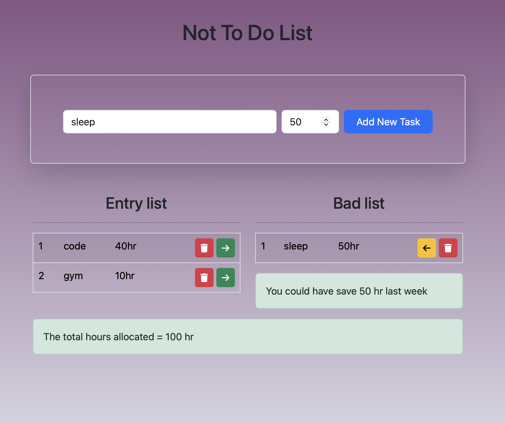

# Not To Do List

A simple task management application that allows users to manage their time by categorizing tasks as "Entry" tasks or "Bad" tasks, helping them stay productive and avoid time-wasting activities.

## Features

- **Task Management**: Add tasks with allocated hours and track them in an entry list.
- **Bad Task List**: Transfer tasks to a "Bad" list for better time management.
- **Time Allocation**: Keeps track of the total allocated hours and prevents exceeding weekly available hours (168 hours).
- **Interactive UI**: Easily move tasks between lists and delete them.

## Technologies Used

- HTML
- CSS (Bootstrap for styling)
- JavaScript (Vanilla JS for task management and DOM manipulation)

## Installation

1. Clone the repository:

   ```bash
   git clone https://github.com/Devendra-1997/not-to-do-list.git
   ```

2. Navigate to the project directory:

   ```bash
   cd not-to-do-list
   ```

3. Open `index.html` in your browser to use the application.

## How to Use

1. **Add Task**: Enter a task name and the number of hours you plan to spend on it, then click the "Add New Task" button.
2. **Track Time**: The task will appear in the "Entry list" with its allocated hours.
3. **Move to Bad List**: If a task turns out to be unproductive, click the right arrow button to move it to the "Bad list".
4. **Switch Back to Entry List**: If needed, you can move tasks back to the "Entry list" by clicking the left arrow button.
5. **Delete Task**: Click the trash icon to delete any task from the lists.
6. **Time Limit**: If your total allocated time exceeds 168 hours (a full week), you will receive a warning.

## File Structure

- `index.html`: The main HTML file that contains the form, task lists, and displays the app.
- `style.css`: The custom CSS file for styling the application.
- `script.js`: Contains the logic for handling form submission, task management, and time calculations.

## Demo

check the link below :
https://not-to-do-list-eta.vercel.app/



## License

This project is open-source and available under the [MIT License](LICENSE).
